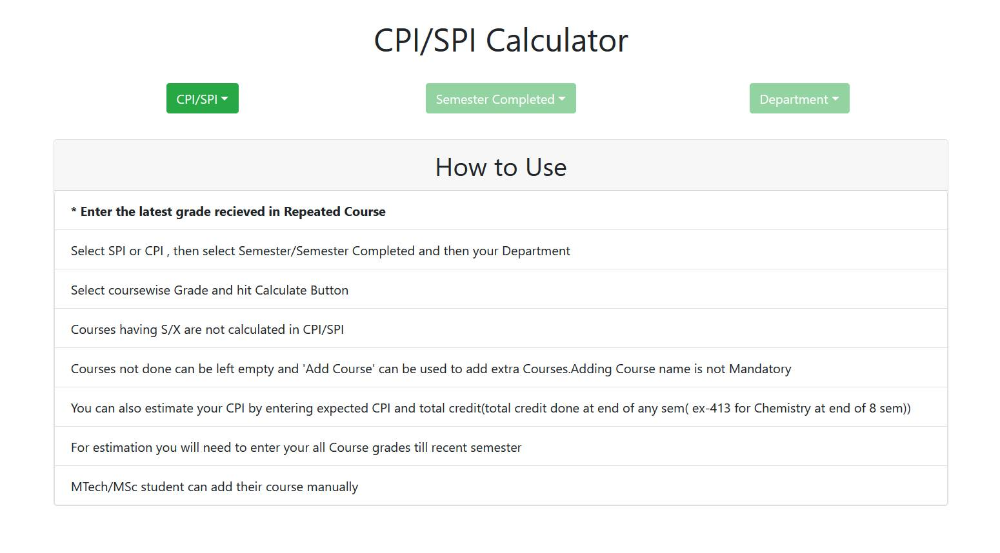
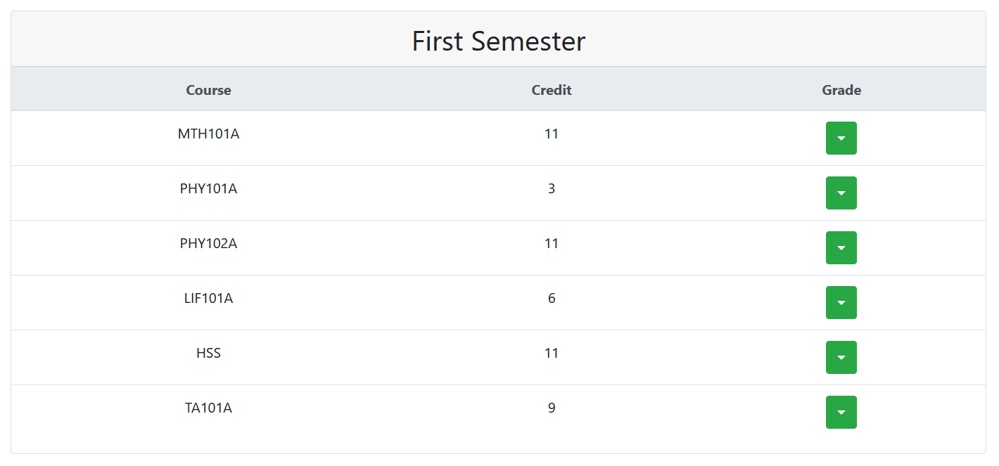
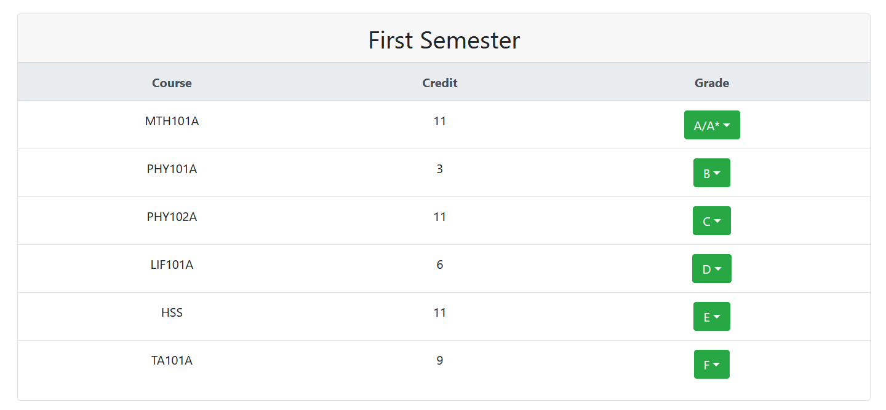
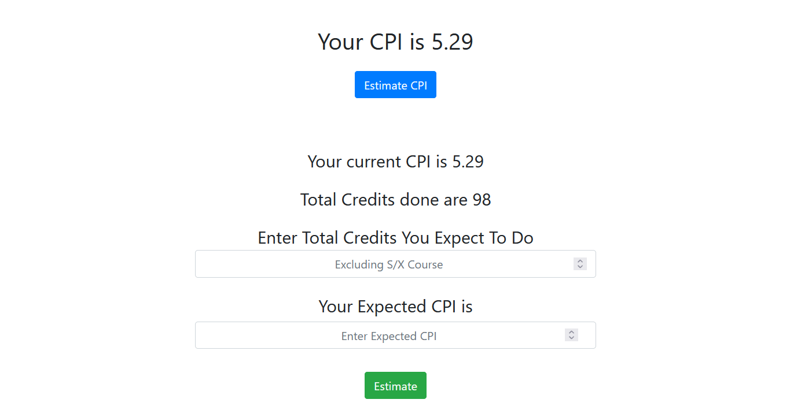

# CPI-SPI-Calculator

CPI/SPI Calculator is a simple and elegant CGPA Calculator made using JavaScript(ES6), that can be used to calculate CGPA quickly.Calculator has over 89k+ views and provides simple way of selecting grade corresponding to courses instead of going through tedious mathematical calculation. It has courses of all Departments of IITK. 
The Project is live at <a href="https://projects.akshayrathi.com/cpi-spi-calculator/" target="_blank">link</a>

## Project Screen Shot(s)

## Installation and Setup Instructions

Clone down this repository and open index.html file in your favorite browser.

## Built With

The project has been build using below frameworks and tools:

- [Javascript](https://developer.mozilla.org/en-US/)
- [Html/CSS](https://developer.mozilla.org/en-US/)
- [Bootstrap](https://getbootstrap.com/)

## Authors

Designed and Developed By [Akshay Rathi](https://akshayrathi.com)

&nbsp;&nbsp;&nbsp;&nbsp;&nbsp;&nbsp;&nbsp;&nbsp;&nbsp;&nbsp;&nbsp;&nbsp;

 
